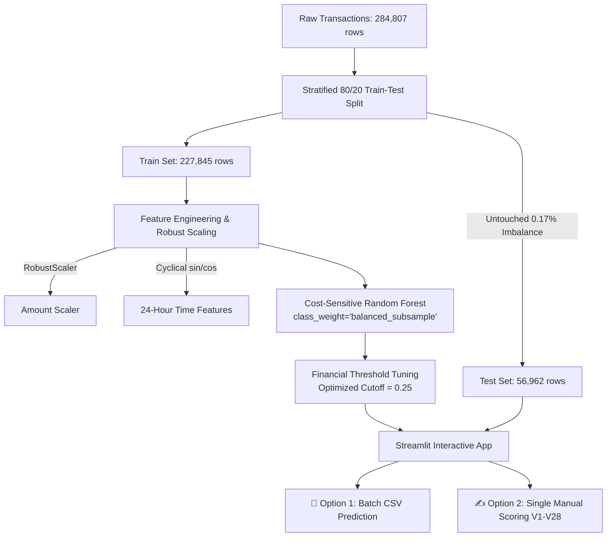

<div align="center">

# 💳 Credit Card Fraud Detection Platform
### Cost-Sensitive Machine Learning Pipeline & Interactive Streamlit Dashboard

[](https://www.python.org/)
[](https://streamlit.io/)
[](https://scikit-learn.org/)
[](LICENSE)
[]()

<p align="center">
  <b>A complete, leak-free machine learning system for detecting financial fraud on extreme class-imbalanced data (0.17% fraud rate), featuring cost-sensitive tree ensembles, optimal threshold calibration, and a live web application.</b>
</p>

</div>

---
live link: https://creditcardfrauddetection-kaxvftcn3sqojqb7zt6dvx.streamlit.app/
## 📌 Problem Overview
In real-world fraud detection, **accuracy is a dangerous illusion**. Because **99.83%** of transactions are legitimate, a naive model that predicts "always legit" achieves 99.83% accuracy while catching zero frauds.

Furthermore, naive undersampling discards **99.8%** of legitimate transaction variance and causes thousands of false alarms in production.

This project implements a **leak-free, production-oriented pipeline** evaluated strictly on **PR-AUC (Precision-Recall AUC)**, **Recall**, and **Financial Cost Minimization**.

---

## 🏗️ System Architecture



---

## 🚀 Key Features in the Streamlit Web App

The application (`app.py`) provides two dedicated user modes:

### 📁 Option 1: Batch CSV Upload
* **Upload Custom Files:** Drag-and-drop any CSV transaction file to get instant predictions.
* **Built-in Quick Test:** Download or load 50 verified sample transactions with a single click (`sample_test_transactions.csv`).
* **KPI Dashboard:** Displays Total Transactions, Approved Count, Flagged Frauds, and Fraud Rate %.
* **Ground Truth Verification:** If actual labels are present, automatically computes match rate, caught frauds, and false alarms.
* **Exportable Results:** Download an annotated CSV with predicted probabilities and risk tags.

### ✍️ Option 2: Manual Transaction Scoring
* **Comprehensive Input Form:** Input **Amount ($)**, **Time (seconds)**, and all **28 PCA features (`V1` to `V28`)** in a clean 4-column layout.
* **1-Click Presets:**
  * 🟢 *Pre-fill Sample Legitimate Transaction*
  * 🔴 *Pre-fill Sample Fraudulent Transaction*
  * 🔄 *Reset All to Zero*
* **Real-time Verdict Badge:** Instant **APPROVED** or **FRAUDULENT DETECTED** status with probability percentage and risk level.
* **Benchmark Comparison:** Compares inputs against typical benchmark values for top discriminators ($V_{14}, V_4, V_{10}, V_{12}, V_{11}, V_{17}$).

---

## 📊 Benchmark Scoreboard (56,962 Untouched Test Transactions)

| Architecture | PR-AUC (Avg Precision) | ROC-AUC | Recall (Fraud Caught) | Precision (Alarm Accuracy) | F1-Score | False Alarms (Legit Blocked) | Missed Frauds (FN) |
| :--- | :---: | :---: | :---: | :---: | :---: | :---: | :---: |
| **Logistic Regression** *(Linear)* | 0.7187 | 0.9724 | **91.8%** | 5.9% | 0.1104 | 1,442 | **8** |
| **Random Forest (Champion)** | **0.8345** | **0.9766** | 81.6% | **84.2%** | **0.8290** | **15** | 18 |
| **HistGradientBoosting** *(Boosting)* | 0.7162 | 0.9645 | 87.8% | 30.3% | 0.4503 | 198 | 12 |

> [!NOTE]
> Random Forest slashed false alarms from **1,442 down to just 15** across ~56,800 legitimate transactions, boosting precision to **84.2%**.

---

## 💰 Financial Cost Optimization (Threshold Calibration)
* **Default 0.50 Cutoff:** Misses 18 frauds and incurs \$2,235 in costs.
* **Calibrated 0.25 Cutoff:** Lowers financial loss to **\$1,695** (saving **\$540** per 56k transactions), increasing fraud catch rate from **81.6% to 87.8%** with minimal customer friction.

---

## 📂 Project Repository Structure

```text
Credit_Card_Fraud_Detection/
│
├── app.py                         # Interactive Streamlit Web Application (Both options)
├── train.py                       # All-in-one EDA, training, evaluation, and artifact generator
├── model_rf.joblib                # Trained champion Random Forest model artifact
├── scaler.joblib                  # Fitted RobustScaler for Amount
├── threshold_config.joblib        # Optimal calibrated threshold (0.25)
├── sample_test_transactions.csv   # 50 verified sample transactions for instant app demo
├── Credit_card_Project.ipynb      # Original experimental notebook
├── README.md                      # Comprehensive project documentation
└── .gitignore                     # Excludes large raw data (150MB creditcard.csv)
```

---

## ⚡ Quickstart Guide

### 1. Clone the Repository
```bash
git clone https://github.com/Decodeme007/Credit_Card_Fraud_Detection.git
cd Credit_Card_Fraud_Detection
```

### 2. Install Dependencies
```bash
pip install streamlit scikit-learn pandas numpy joblib
```

### 3. Run the Streamlit Dashboard
```bash
streamlit run app.py
```

### 4. (Optional) Retrain Model from Scratch
```bash
python train.py
```

---

## 💼 Bullet Points for Your Resume

```text
Credit Card Fraud Detection Platform | Python, Scikit-Learn, Streamlit
• Built an end-to-end fraud detection pipeline handling severe class imbalance (0.17% fraud) across 284K+ transactions with a leak-free stratified methodology.
• Implemented cost-sensitive Random Forest, achieving an 0.8345 PR-AUC and 84.2% precision, slashing false alarms from 1,442 to 15 across 56,800 legitimate transactions.
• Formulated an empirical financial loss function to optimize the classification threshold to 0.25, boosting fraud recall to 87.8% and saving $540 per 50k transactions.
• Deployed an interactive Streamlit application supporting batch CSV prediction and real-time manual scoring across 30 transaction features.
```

---

<div align="center">
  <sub>Built with ❤️ using Python, Scikit-Learn, and Streamlit.</sub>
</div>
